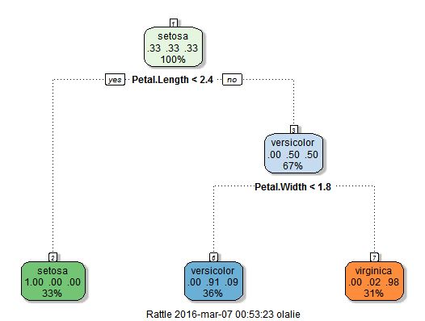

## Explore the Iris data set
### Tables

```
##   Sepal.Length Sepal.Width Petal.Length Petal.Width Species
## 1          5.1         3.5          1.4         0.2  setosa
## 2          4.9         3.0          1.4         0.2  setosa
## 3          4.7         3.2          1.3         0.2  setosa
```

### Interactive plots


--- 

## Study the model

### rpart

<table>
  <tr>
    <td width=50% style="vertical-align:top">A regression tree may likely be an over-simplification of the true relationship,
      but it is easier to interpret than other types of regression models,
      and has a nice graphical representation.
    </td>
    <td align="bottom">
    </td>
  </tr>
</table>

---

## Online Prediction


--- #custbg2

<style>
#custbg2 {
  background-image:url(./assets/img/webapp.png); 
  background-repeat: no-repeat;
  background-position: center center;
  background-size: contain;
}
</style>
<br />
<br />
## Visit the
[Web App](https://olalie.shinyapps.io/iris/)
<br />
<br />
<br />
